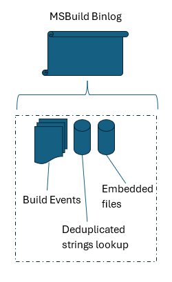
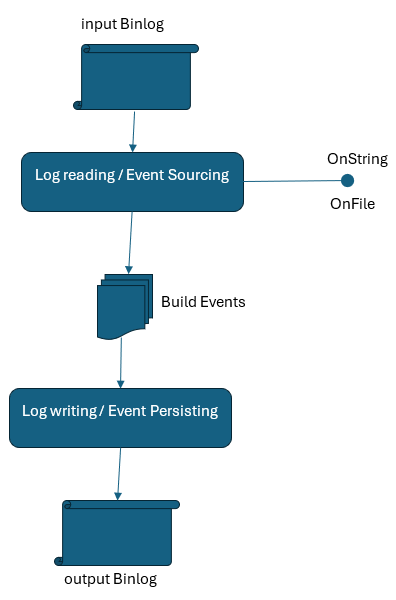

## Background
MSBuild binlog technical info: https://github.com/dotnet/msbuild/blob/main/documentation/wiki/Binary-Log.md

Since binlogs contain detailed build logs, they can happen to contain sensitive data - credentials, internal paths, sealed build environemnt details etc.
Being able to provide binlogs is vital for builds troubleshooting. For those reasons it may be helpful to be able to redact sensitive data from binlogs - before providing them for investigation, or before automatically publishing them as build artifacts.

## Cracking proprietary format
MSBuild Binlog is a properietary data format:



The important parts for us:
* Strings are deduplicated and stored separately. They are transparently added to the Build Events returned by the reader/event source
* Embedded files are transparently processed during shutdown of logging. Those files can (and usually do) contain textual data as well - those are not deduplicated.
* <a name="stamping"></a>Each produced binlog - including the replayed one - is stamped with runtime info (version, args) from the current run
* <a name="binary_inequality"></a>Binary logs were designed/tested for full reproducibility, but not necessarily for 1:1 binary equality (in some cases some empty structures can change to nulls etc.)
* The binlog file is a GZip archive

## High level interface requirements for redacting

### 10k foot view

All we need is to be able to replace strings matching our criteria:

```csharp
Redactor.Redact(string binlogPath, Func<string, string> matchAndReplace);
```

### Considering embedded files 

* Embedded files editing
  * Path - string data
  * Content - be able to edit as string data (for simplicity) or stream (for optimized access)

```csharp
public class ArchiveFile
{
    public StreamReader GetContentReader();
    public string GetContent();
}

Func<ArchiveFile, ArchiveFile> RedactFile;
```

### Considering compression and unknown data offsets

* Compression format imposes need to rewrite whole binlog (no in place edits)
* Events do not have given length - size of the event is influenced by it's content (e.g. nullable fields). => skipping without encoding would require explicitly inserted offsets/sizes in binlog files - this would be at expense of size/perf of binlogs for other scenrios (writing/replaying)
* Conclusion: It makes most sense to leverage Replay functionality for binlogs postprocessing


### Replay interface needs for redacting

* We need to be able to learn about detected string and be able to edit it, before any build event containing such string is emited by the event source.
   * Editing strings later would lead to emiting events with unwanted strings
   * Editing strings within events would mean duplicate processing (as binlog has deduplicated strings - unlike build events)
* We can either allow injecting processor, or emit events (the later allows more natural way of chaining multiple redactors)



The strings redacting interface (pseudocode):

```csharp
public event Action<StringReadEventArgs>? StringReadDone;

public sealed class StringReadEventArgs : EventArgs
{
    /// <summary>
    /// The original string that was read from the binary log.
    /// </summary>
    public string OriginalString { get; private set; }

    /// <summary>
    /// The adjusted string (or the original string of none subscriber replaced it) that will be used by the reader.
    /// </summary>
    public string StringToBeUsed { get; set; }
}
```

The files redacting interface (pseudocode):

```csharp
public event Action<ArchiveFileEventArgs>? ArchiveFileEncountered;

public sealed class ArchiveFileEventArgs : EventArgs
{
    public ArchiveFileEventArgs(ArchiveFile archiveFile);

    public ArchiveFile ObtainArchiveFile();

    public void SetResult(string resultPath, Stream resultStream);

    public void SetResult(string resultPath, string resultContent);
}

public sealed class ArchiveFile
{
    public ArchiveFile(string fullPath, Stream contentStream)

    public ArchiveFile(string fullPath, string content, Encoding? contentEncoding = null)

    public static ArchiveFile From(ZipArchiveEntry entry);

    public string FullPath { get; }
    public Encoding Encoding { get; }
    public bool CanUseReader { get; }
    public bool CanUseString { get; }

    public StreamReader GetContentReader();
    public string GetContent();
}
```

File content needs to be handleable via the simplified string editing handler as well:

```csharp
// Redacting handler (external code)
private void OnStringReadDone(StringReadEventArgs e)
{
    e.StringToBeUsed = e.StringToBeUsed.Replace("some-password", "******");
}

private void SubscribeToEvents()
{
    // Subscribing string redacting handler to string reads
    reader.StringReadDone += OnStringReadDone;
    // Subscribing string redacting handler to embedded file reads
    reader.ArchiveFileEncountered += ((Action< StringReadEventArgs>)OnStringReadDone).ToArchiveFileHandler();
}
```

## Code ownership

Proposal of what code should be first class citizen of MSBuild vs an external code.

#### Strong case for MSBuild

* De/serialization events reproducibility (rounds of serializing/deserializing should produce identical data). Needed for testability and evnet sourcing corectness (replay scenarios). Should be part of events definition
* Support for determinisitic compression (greedy bufffering). Needed for testability. Should be possible to turn on for a binlog produced by build.

#### Suggested for MSBuild
* OM of embedded files
* Emiting string and archive file events from binlog event source
* Ability to replay embedded files

#### Suggested for MSBuild #2
* The string and archive file events allow edting

#### Suggested for external code
* Library and CLI for binlogs postprocessing
* Definition and implementation of redacting interface/libraries